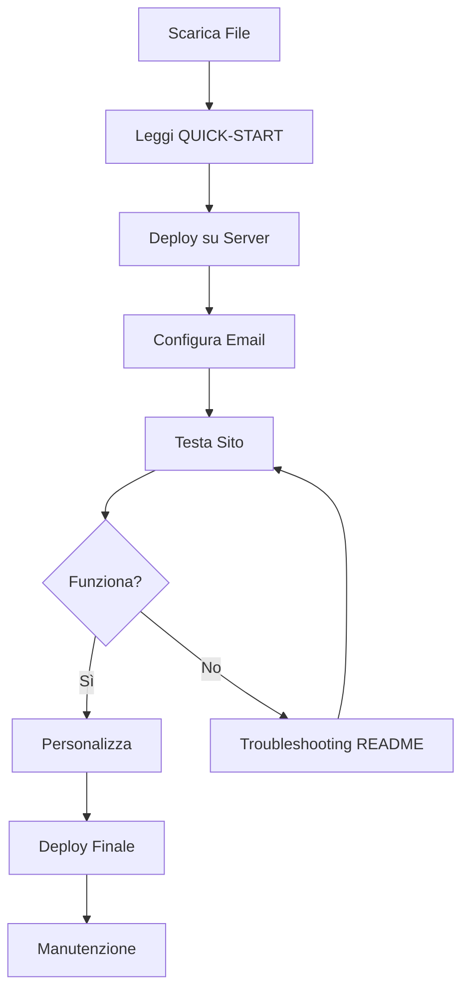

# 📚 Indice Documentazione - Migasender

Benvenuto nella documentazione completa del sito web Migasender!

---

## 🚀 Per Iniziare

### Nuovo Utente? Inizia da Qui:

1. **[QUICK-START.md](QUICK-START.md)** ⚡  
   *Deploy in 5 minuti!*
   - Guida rapida per andare online
   - Checklist essenziale
   - Troubleshooting veloce

2. **[README.md](README.md)** 📖  
   *Documentazione completa*
   - Panoramica progetto
   - Funzionalità complete
   - Installazione dettagliata
   - Configurazione email
   - Performance e SEO

---

## 🎨 Personalizzazione

3. **[CUSTOMIZATION.md](CUSTOMIZATION.md)** 🎨  
   *Guida personalizzazione completa*
   - Cambia colori e brand
   - Modifica logo e immagini
   - Personalizza testi e contenuti
   - Aggiungi tracking e analytics
   - Ottimizza SEO
   - Aggiusta form e notifiche

---

## 📋 Gestione Progetto

4. **[CHANGELOG.md](CHANGELOG.md)** 📝  
   *Storico versioni e modifiche*
   - Release notes
   - Funzionalità aggiunte
   - Bug fixes
   - Roadmap futura

5. **[LICENSE.md](LICENSE.md)** ⚖️  
   *Termini di utilizzo e copyright*
   - Diritti di proprietà
   - Uso consentito/non consentito
   - Disclaimer e responsabilità
   - Privacy e GDPR

---

## 🗂️ File Tecnici

### File Principali:

**HTML:**
- `index.html` - Pagina principale del sito (48KB)

**CSS:**
- `css/style.css` - Foglio di stile completo (18KB)

**JavaScript:**
- `js/main.js` - Logica e interattività (18KB)

**PHP:**
- `form-handler.php` - Backend per form submissions (12KB)

**Immagini:**
- `images/logo.png` - Logo Migasender (32KB)

### File Configurazione:

- `.htaccess` - Configurazione Apache (performance, sicurezza)
- `.gitignore` - File da escludere da Git
- `robots.txt` - Configurazione SEO per bot
- `sitemap.xml` - Mappa del sito per motori di ricerca

---

## 📊 Struttura Progetto

```
migasender-website/
│
├── 📄 HTML
│   └── index.html                    Pagina principale
│
├── 🎨 CSS
│   └── css/
│       └── style.css                 Stili completi
│
├── ⚙️ JavaScript
│   └── js/
│       └── main.js                   Logica + AJAX
│
├── 🖼️ Media
│   └── images/
│       └── logo.png                  Logo brand
│
├── 🔧 Backend
│   └── form-handler.php              Form processing
│
├── ⚙️ Config
│   ├── .htaccess                     Apache config
│   ├── .gitignore                    Git exclusions
│   ├── robots.txt                    SEO bot config
│   └── sitemap.xml                   SEO sitemap
│
└── 📚 Documentazione
    ├── INDEX.md                      Questo file
    ├── README.md                     Documentazione completa
    ├── QUICK-START.md                Guida rapida
    ├── CUSTOMIZATION.md              Personalizzazione
    ├── CHANGELOG.md                  Versioni
    └── LICENSE.md                    Licenza

PESO TOTALE: ~120KB (eccellente!)
```

---

## 🎯 Guide per Caso d'Uso

### Voglio Deploy Veloce
👉 Leggi: [QUICK-START.md](QUICK-START.md)

### Voglio Capire Tutto
👉 Leggi: [README.md](README.md)

### Voglio Personalizzare
👉 Leggi: [CUSTOMIZATION.md](CUSTOMIZATION.md)

### Voglio Vedere Aggiornamenti
👉 Leggi: [CHANGELOG.md](CHANGELOG.md)

### Ho Questioni Legali
👉 Leggi: [LICENSE.md](LICENSE.md)

---

## 🔍 Ricerca Rapida

### Come faccio a...

**...mettere online il sito?**
→ [QUICK-START.md](QUICK-START.md) - Passo 1-5

**...cambiare colori?**
→ [CUSTOMIZATION.md](CUSTOMIZATION.md) - Sezione "Colori e Brand"

**...sostituire il logo?**
→ [CUSTOMIZATION.md](CUSTOMIZATION.md) - Sezione "Logo e Immagini"

**...configurare email?**
→ [README.md](README.md) - Sezione "Configurazione Email"

**...modificare i prezzi?**
→ [CUSTOMIZATION.md](CUSTOMIZATION.md) - Sezione "Testi e Contenuti"

**...aggiungere Google Analytics?**
→ [CUSTOMIZATION.md](CUSTOMIZATION.md) - Sezione "Analytics e Tracking"

**...modificare le FAQ?**
→ [CUSTOMIZATION.md](CUSTOMIZATION.md) - Sezione "Testi e Contenuti"

**...risolvere problemi email?**
→ [README.md](README.md) - Sezione "Troubleshooting"

**...aggiungere favicon?**
→ [CUSTOMIZATION.md](CUSTOMIZATION.md) - Sezione "Logo e Immagini"

**...cambiare font?**
→ [CUSTOMIZATION.md](CUSTOMIZATION.md) - Sezione "Font e Tipografia"

---

## 📞 Supporto

### Documentazione Non Basta?

**Email:** support@migastone.com  
**Telefono:** +39 0541 1795006  
**PEC:** migawin@pec.it

**Orari:** Lun-Ven 9:00-18:00 (CET)

### Prima di Contattarci:

✅ Hai letto [QUICK-START.md](QUICK-START.md)?  
✅ Hai controllato [README.md](README.md) troubleshooting?  
✅ Hai provato a cercare in [CUSTOMIZATION.md](CUSTOMIZATION.md)?

Questo ci aiuta a darti supporto più veloce!

---

## 🎓 Livello di Competenza

### 👶 Principiante
**Inizia con:**
1. [QUICK-START.md](QUICK-START.md)
2. Sezioni "Personalizzazioni Rapide" in [CUSTOMIZATION.md](CUSTOMIZATION.md)

**Evita:**
- Modifiche complesse al CSS
- Modifiche al JavaScript
- Modifiche a form-handler.php

### 🧑 Intermedio
**Puoi gestire:**
- Tutte le personalizzazioni in [CUSTOMIZATION.md](CUSTOMIZATION.md)
- Modifiche HTML di base
- Configurazioni in [README.md](README.md)

**Attenzione a:**
- Modifiche strutturali HTML
- JavaScript avanzato

### 👨‍💻 Avanzato
**Puoi fare:**
- Qualsiasi modifica
- Integrazioni custom
- Ottimizzazioni avanzate
- Debugging complesso

**Ricorda:**
- Sempre backup prima di modifiche
- Segui best practices
- Mantieni documentato

---

## ✅ Checklist Generale

### Pre-Deploy
- [ ] Letto [QUICK-START.md](QUICK-START.md)
- [ ] Configurato email in form-handler.php
- [ ] Modificato contenuti in index.html
- [ ] Sostituito logo (opzionale)
- [ ] Cambiato colori (opzionale)
- [ ] Aggiunto analytics (opzionale)

### Post-Deploy
- [ ] Testato form contatto
- [ ] Verificato email ricevute
- [ ] Controllato responsive mobile
- [ ] Testato su browser multipli
- [ ] Verificato SSL attivo
- [ ] Controllato Google Search Console
- [ ] Backup completato

### Manutenzione Continua
- [ ] Controllo mensile email funzionanti
- [ ] Aggiornamento contenuti
- [ ] Verifica analytics
- [ ] Backup regolari
- [ ] Monitoraggio uptime

---

## 🔄 Workflow Consigliato



---

## 📈 Prossimi Passi

### Dopo Deploy Iniziale:

1. **Ottimizzazione SEO**
   - Configura Google Search Console
   - Aggiungi Bing Webmaster Tools
   - Ottimizza meta tags

2. **Analisi Performance**
   - Test PageSpeed Insights
   - Verifica GTmetrix
   - Controlla WebPageTest

3. **Marketing Setup**
   - Configura email marketing
   - Setup social media
   - Piano contenuti blog

4. **Monitoraggio**
   - Setup Uptime monitoring
   - Configura alerting
   - Backup automatici

---

## 📦 Versione Corrente

**Versione:** 1.0.0  
**Release:** Dicembre 2024  
**Ultimo aggiornamento:** 11 Dicembre 2024

Vedi [CHANGELOG.md](CHANGELOG.md) per dettagli.

---

## 🌟 Contributi

Attualmente il progetto non accetta contributi pubblici.

Per segnalazioni bug o richieste funzionalità:
📧 support@migastone.com

---

## 📄 Licenza

© 2024 Migastone International SRL  
Tutti i diritti riservati.

Vedi [LICENSE.md](LICENSE.md) per termini completi.

---

## 🙏 Ringraziamenti

**Tecnologie Open Source Utilizzate:**
- Font Awesome (Icone)
- Google Fonts (Typography)
- HTML5 / CSS3 / JavaScript ES6

**Sviluppato per:**  
Migastone International SRL  
Via 28 Luglio 212  
Borgo Maggiore, 47893  
San Marino

---

**Buon lavoro con Migasender! 🚀**

*Ultimo aggiornamento: 11 Dicembre 2024*