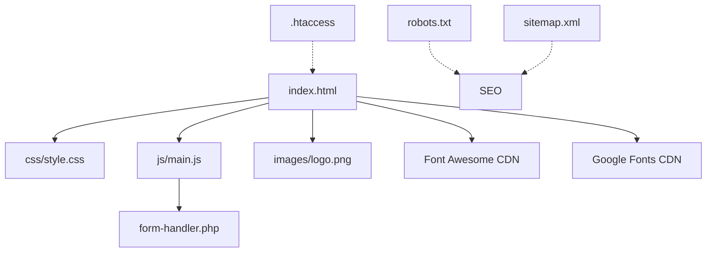

# 📂 Struttura Progetto - Migasender

## 🗂️ Panoramica File e Cartelle

```
migasender-website/
│
├── 📄 PAGINE WEB
│   └── index.html                    (48KB)  Pagina principale del sito
│
├── 🎨 STILI
│   └── css/
│       └── style.css                 (18KB)  Tutti gli stili CSS
│
├── ⚙️ JAVASCRIPT
│   └── js/
│       └── main.js                   (18KB)  Logica, interattività, AJAX
│
├── 🖼️ MEDIA
│   └── images/
│       └── logo.png                  (32KB)  Logo Migasender
│
├── 🔧 BACKEND
│   └── form-handler.php              (12KB)  Gestione form submissions
│
├── ⚙️ CONFIGURAZIONE
│   ├── .htaccess                     (4KB)   Apache config (performance + security)
│   ├── .gitignore                    (1KB)   Git exclusions
│   ├── robots.txt                    (1KB)   SEO bot instructions
│   └── sitemap.xml                   (1KB)   SEO sitemap
│
└── 📚 DOCUMENTAZIONE
    ├── START-HERE.md                 (7KB)   👈 INIZIA QUI!
    ├── INDEX.md                      (8KB)   Indice navigazione docs
    ├── QUICK-START.md                (3KB)   Deploy rapido (5 minuti)
    ├── README.md                     (14KB)  Documentazione completa
    ├── CUSTOMIZATION.md              (11KB)  Guida personalizzazione
    ├── CHANGELOG.md                  (4KB)   Storico versioni
    ├── LICENSE.md                    (6KB)   Termini e copyright
    └── PROJECT-STRUCTURE.md          Questo file!

PESO TOTALE: ~130KB
```

---

## 📄 File Principali Spiegati

### 🌐 Web Files

#### `index.html` (48KB)
**Cosa contiene:**
- Navigazione header
- Hero section con form
- Features (3 card)
- Prossimi aggiornamenti (9 card)
- CTA centrale
- Prezzi (4 piani)
- Prodotti (8 servizi)
- FAQ (10 domande)
- Form contatti
- Footer completo
- Modal GDPR

**Quando modificarlo:**
- Cambiare testi
- Aggiungere/rimuovere sezioni
- Modificare struttura

**NON modificare se:**
- Non sai HTML
- Non hai backup

---

### 🎨 CSS Files

#### `css/style.css` (18KB)
**Cosa contiene:**
- Variabili colori (righe 7-17)
- Reset e base styles
- Layout responsive
- Componenti (buttons, cards, forms)
- Animazioni
- Media queries

**Quando modificarlo:**
- Cambiare colori
- Modificare dimensioni
- Aggiustare spaziature
- Aggiungere animazioni

**Sezioni principali:**
```css
:root { ... }              /* Variabili colori */
* { ... }                  /* Reset */
.container { ... }         /* Layout */
.btn { ... }               /* Bottoni */
.navbar { ... }            /* Navigazione */
.hero { ... }              /* Hero section */
.pricing-card { ... }      /* Prezzi */
@media { ... }             /* Responsive */
```

---

### ⚙️ JavaScript Files

#### `js/main.js` (18KB)
**Cosa contiene:**
- Configurazione (righe 1-15)
- Menu mobile toggle
- FAQ accordion
- Modal GDPR
- **Form AJAX** con validazione
- Notifiche toast
- Smooth scroll
- Animations
- Tracking

**Quando modificarlo:**
- Cambiare messaggi form
- Aggiungere tracking
- Modificare validazioni
- Aggiungere interattività

**Funzioni principali:**
```javascript
validateForm()         // Validazione client-side
showNotification()     // Toast notifications
trackFormSubmission()  // Analytics tracking
```

---

### 🔧 Backend Files

#### `form-handler.php` (12KB)
**Cosa contiene:**
- Configurazione email (righe 28-31)
- Validazione server-side
- Sanitizzazione input
- Invio email HTML
- Logging submissions
- Database functions (opzionali)

**⚠️ DEVI MODIFICARE:**
Riga 28-31 con le tue email:
```php
define('MIGASENDER_ADMIN_EMAIL', 'tuaemail@example.com');
define('MIGASENDER_CC_EMAIL', 'email-copia@example.com');
```

**Quando modificarlo:**
- Configurare email (sempre!)
- Aggiungere campi form
- Modificare validazioni
- Cambiare template email

**NON modificare se:**
- Non conosci PHP
- Non sai cosa fa

---

### ⚙️ Configuration Files

#### `.htaccess` (4KB)
**Cosa fa:**
- Abilita GZIP compression
- Configura browser caching
- Protegge file sensibili
- Sicurezza headers
- (Opzionale) Redirect HTTPS
- (Opzionale) WWW redirect

**Quando modificarlo:**
- Attivare HTTPS redirect
- Cambiare cache times
- Aggiungere protezioni

**Sezioni:**
```apache
# SICUREZZA        (righe 5-15)
# PERFORMANCE      (righe 20-50)
# REWRITE RULES    (righe 55-70)
# MIME TYPES       (righe 75-85)
```

#### `.gitignore` (1KB)
**Cosa fa:**
- Esclude file da Git
- Ignora logs
- Nasconde file sensibili

**Quando modificarlo:**
- Aggiungere file da ignorare
- Escludere cartelle temporanee

#### `robots.txt` (1KB)
**Cosa fa:**
- Istruzioni per bot SEO
- Allow/Disallow pages
- Link a sitemap

**Quando modificarlo:**
- Bloccare sezioni private
- Aggiornare sitemap URL

#### `sitemap.xml` (1KB)
**Cosa fa:**
- Mappa del sito per Google
- Priorità pagine
- Frequenza aggiornamenti

**⚠️ DEVI MODIFICARE:**
Cambia `tuosito.com` con il tuo dominio!

---

## 📚 Documentation Files

### 🎯 Guide Operative

#### `START-HERE.md` (7KB)
**Per chi:** Tutti, specialmente principianti  
**Quando leggerlo:** SUBITO, prima di tutto  
**Cosa contiene:** Introduzione e navigazione rapida

#### `QUICK-START.md` (3KB)
**Per chi:** Chi vuole deploy veloce  
**Quando leggerlo:** Prima del deploy  
**Cosa contiene:** 5 passi per andare online

#### `README.md` (14KB)
**Per chi:** Chi vuole capire tutto  
**Quando leggerlo:** Dopo deploy iniziale  
**Cosa contiene:** Documentazione tecnica completa

#### `CUSTOMIZATION.md` (11KB)
**Per chi:** Chi vuole personalizzare  
**Quando leggerlo:** Dopo deploy  
**Cosa contiene:** Guide personalizzazione complete

### 📋 Guide Informative

#### `INDEX.md` (8KB)
**Per chi:** Chi si perde nei documenti  
**Cosa contiene:** Indice navigazione completo

#### `CHANGELOG.md` (4KB)
**Per chi:** Chi vuole vedere le versioni  
**Cosa contiene:** Storico modifiche e roadmap

#### `LICENSE.md` (6KB)
**Per chi:** Questioni legali  
**Cosa contiene:** Termini uso e copyright

#### `PROJECT-STRUCTURE.md`
**Per chi:** Chi vuole capire l'organizzazione  
**Cosa contiene:** Questo file!

---

## 📊 Peso e Performance

### Breakdown File Sizes:

| Categoria | File | Dimensione | % Totale |
|-----------|------|------------|----------|
| **HTML** | index.html | 48KB | 37% |
| **CSS** | style.css | 18KB | 14% |
| **JavaScript** | main.js | 18KB | 14% |
| **Immagini** | logo.png | 32KB | 25% |
| **PHP** | form-handler.php | 12KB | 9% |
| **Docs** | *.md | 60KB | Locale |
| **Config** | .htaccess, etc. | 7KB | Locale |
| **TOTALE WEB** | | **128KB** | 100% |

### Performance Impact:

**Caricato dal browser:**
- HTML: 48KB ✅
- CSS: 18KB ✅
- JS: 18KB ✅
- Logo: 32KB ✅
- Font Awesome: ~75KB (CDN) ⚡
- Google Fonts: ~30KB (CDN) ⚡

**TOTALE DOWNLOAD:** ~221KB  
**Eccellente!** Target < 500KB ✅

---

## 🔄 File Dependencies (Dipendenze)



**Legenda:**
- `-->` Dipendenza diretta
- `-.->` Dipendenza indiretta

---

## 🗄️ File Necessari vs Opzionali

### ✅ File OBBLIGATORI (per funzionare):

```
✅ index.html
✅ css/style.css
✅ js/main.js
✅ images/logo.png
✅ form-handler.php
```

**Senza questi il sito non funziona!**

### 📝 File RACCOMANDATI:

```
⭐ .htaccess          (performance + security)
⭐ robots.txt         (SEO)
⭐ sitemap.xml        (SEO)
```

**Fortemente consigliati ma non obbligatori**

### 📚 File DOCUMENTAZIONE (locali):

```
📄 START-HERE.md
📄 QUICK-START.md
📄 README.md
📄 CUSTOMIZATION.md
📄 INDEX.md
📄 CHANGELOG.md
📄 LICENSE.md
📄 PROJECT-STRUCTURE.md
📄 .gitignore
```

**Non necessari per il funzionamento online**  
**Ma utili per manutenzione e modifiche**

---

## 📦 File per Deploy

### Caricare su Server FTP:

```
✅ index.html
✅ form-handler.php
✅ .htaccess
✅ robots.txt
✅ sitemap.xml
✅ css/ (intera cartella)
✅ js/ (intera cartella)
✅ images/ (intera cartella)
```

### NON caricare:

```
❌ *.md (documentazione)
❌ .gitignore
❌ .git/ (se presente)
❌ backup files
```

---

## 🔍 Come Trovare Cosa

### Voglio modificare...

**...i colori:**
→ `css/style.css` (righe 7-17)

**...il logo:**
→ `images/logo.png`

**...i testi:**
→ `index.html` (cerca il testo)

**...i prezzi:**
→ `index.html` (cerca "pricing-price")

**...le FAQ:**
→ `index.html` (cerca "faq-item")

**...l'email destinazione:**
→ `form-handler.php` (riga 28)

**...i messaggi notifiche:**
→ `js/main.js` (righe 8-14)

**...le animazioni:**
→ `css/style.css` (cerca "@keyframes")

---

## 🎯 Priorità Modifiche

### 🔴 PRIORITÀ ALTA (da fare subito):

1. Email in `form-handler.php`
2. URL in `sitemap.xml`
3. Meta tags in `index.html`

### 🟡 PRIORITÀ MEDIA (quando hai tempo):

1. Colori brand in `css/style.css`
2. Logo in `images/`
3. Contenuti in `index.html`
4. Analytics in `index.html`

### 🟢 PRIORITÀ BASSA (opzionale):

1. Animazioni custom
2. Sezioni aggiuntive
3. Integrazioni avanzate

---

## 📞 Supporto Struttura File

Domande su come è organizzato il progetto?

📧 support@migastone.com  
📞 +39 0541 1795006

---

**Ultima modifica:** Dicembre 2024  
**Versione:** 1.0.0

© 2024 Migastone International SRL